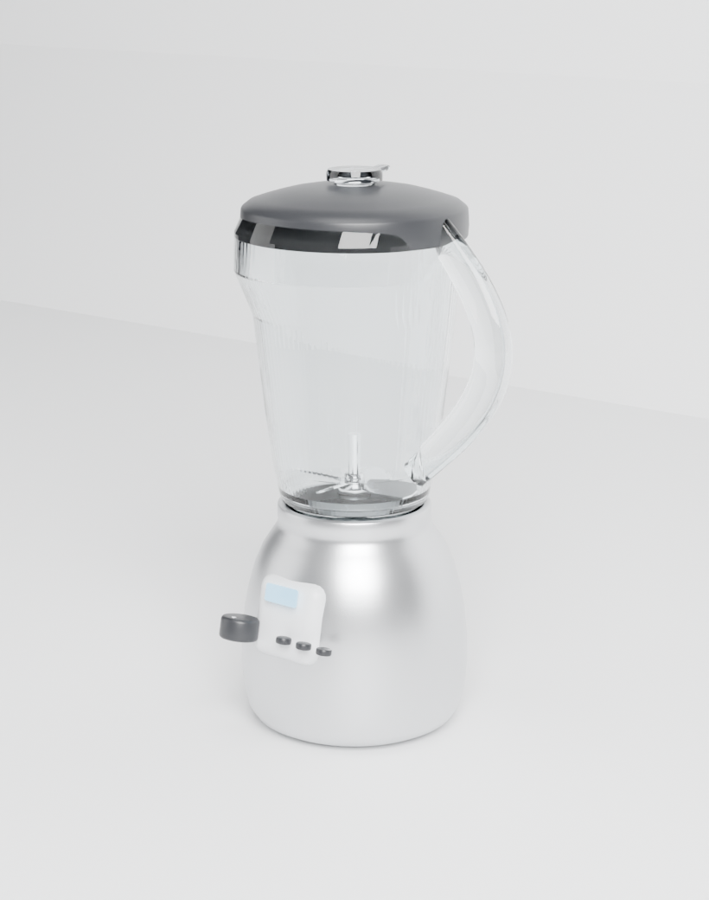

# mappaAI — Frullatore 3D

Modello 3D di un **frullatore** generato in modo **procedurale con Blender** (script Python +
`bpy`), esportato in `.blend` e `.glb`, con rendering Cycles e un viewer web interattivo.



---

## Cosa contiene il modello

| Gruppo | Pezzi |
|---|---|
| Corpo motore | base in acciaio spazzolato, collare di alloggiamento, feritoia d'aerazione, 4 piedini in gomma |
| Comandi | pannello inclinato, display LED emissivo, manopola con tacca, 3 pulsanti |
| Brocca | vetro con profilo cavo, beccuccio modellato, manico ad ansa, guarnizione |
| Gruppo lame | albero, mozzo, dado esagonale, 4 lame inclinate in acciaio inox |
| Coperchio | bordo di tenuta, cupola forata, tappo dosatore con linguetta |

Caratteristiche tecniche:

* **scala reale** — 1 unità Blender = 1 metro; ingombro ≈ 22,8 × 20,0 × 42,8 cm
  (larghezza comprensiva di manico, altezza totale con coperchio)
* **materiali PBR** — acciaio spazzolato (metallic 0,85 + micro-rilievo), vetro con trasmissione
  (IOR 1,46), plastica, gomma, display emissivo
* **geometria pulita** — quadi tutte superfici di rivoluzione e sweep, con bevel e shading
  smooth per angolo, normals ricalcolate
* **due formati** — `.blend` (nativo, con studio luci e camera) e `.glb` (glTF binario per web,
  game engine, AR)

---

## Avvio rapido

### 1. Con Blender installato

```bash
blender --background --python scripts/costruisci_frullatore.py -- --render
```

### 2. Con il modulo Python `bpy` (senza Blender, anche su server headless)

```bash
./tools/setup_blender_env.sh          # installa bpy 4.2 e prepara le librerie di sistema
source tools/attiva_ambiente.sh
python3 scripts/costruisci_frullatore.py --render
```

### 3. Con CMake

```bash
cmake -S . -B build                                   # usa Blender dall'ambiente
cmake --build build                                   # genera .blend + .glb
cmake --build build --target rendering                # rendering Cycles
cmake --build build --target viewer                   # viewer web su :8000
# senza Blender installato:  cmake -S . -B build -DUSO_BPY=ON
```

### 4. Viewer web interattivo

```bash
npm install --prefix viewer      # three.js (solo la prima volta)
python3 tools/serve.py 8000      # → http://localhost:8000/viewer/
```

Il viewer permette di **ruotare/zoomare** il modello, attivare la **rotazione automatica**,
la **vista esplosa** (con slider) e il **wireframe**, e di scaricare `.glb`, `.blend` e i
rendering. three.js è servito localmente da `viewer/node_modules`, quindi funziona anche
senza connessione a CDN esterne.

---

## Opzioni dello script di modellazione

```
python3 scripts/costruisci_frullatore.py [--render] [--campioni 128]
                                         [--risoluzione 820 1040] [--solo-render]
```

Tutte le dimensioni del frullatore sono raccolte nella classe `Dim` in cima al file
(`BASE_R_MAX`, `BROCCA_H`, `LAMA_LUNGA`, …): modificando quei valori si ottiene una variante
del modello, che viene poi ricalcolata da zero.

---

## Struttura del progetto

```
├── CMakeLists.txt                  # flusso CMake: modello, rendering, viewer
├── models/
│   ├── frullatore.blend            # modello nativo Blender (luci + camera inclusi)
│   └── frullatore.glb              # export glTF binario
├── renders/
│   ├── hero_3-4.png                # vista principale
│   ├── dettaglio_comandi.png       # dettaglio pannello e lame
│   └── vista_frontale.png          # vista ortogonale frontale
├── scripts/
│   └── costruisci_frullatore.py    # generatore procedurale (bpy)
├── tools/
│   ├── serve.py                    # server statico per il viewer
│   └── setup_blender_env.sh        # bpy + librerie stub per l'uso headless
└── viewer/
    ├── index.html                  # interfaccia del viewer
    └── app.js                      # scena three.js (luci, ombre, esploso)
```

---

## Note sull'ambiente headless

Il pacchetto `bpy` richiede a runtime alcune librerie X11/GL che nelle immagini server
minimali non sono presenti. `tools/setup_blender_env.sh` compila delle **librerie stub**
con i soli simboli richiesti dai binari di Blender: sono sufficienti per il rendering CPU
(Cycles) e per l'export glTF. Gli stub generati (`tools/blender_stubs/`) non vengono
versionati.

Il rendering usa **Cycles su CPU** con denoising OpenImageDenoise: sui rendering forniti
sono stati usati 110 campioni adattivi nelle risoluzioni indicate nel comando.
